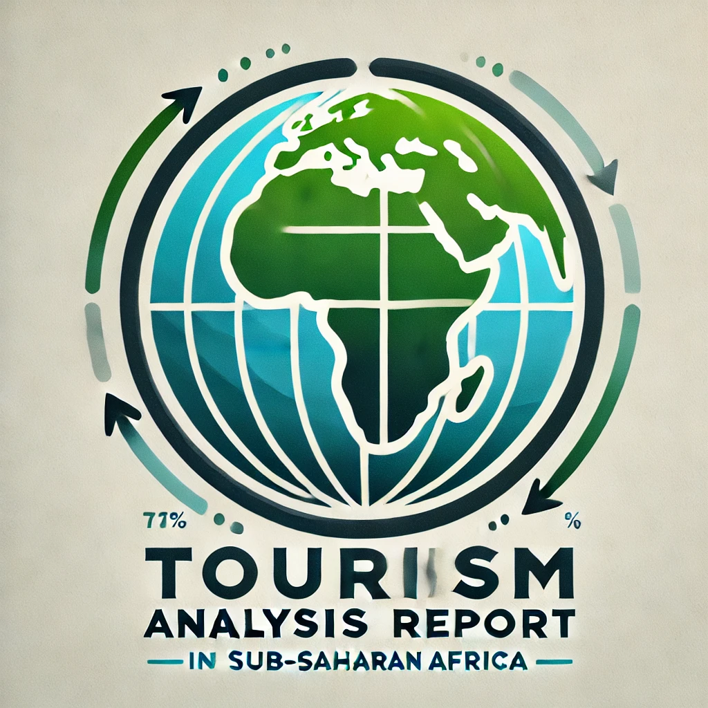

# The Pandemic Effect on Sub-Saharan Africa International Tourism

### Overview

This repository contains an analysis report on the impact of the COVID-19 pandemic on international tourism in Sub-Saharan Africa, focusing on tourist arrivals and tourism receipts from 2018 to 2020. Through comparative analysis with selected European countries, the study explores how the pandemic affected tourism-dependent economies, shedding light on the economic trends, business dynamics, and policy responses in each region.

### Objective

To provide actionable insights and strategic guidance for the revitalization of Sub-Saharan Africa's tourism industry post-pandemic, this study examines data on:

- Tourist arrivals and receipts
- The economic impact of tourism
- Policy responses to pandemic-related challenges

### Methodology

Using a data-driven, comparative approach, this study:

- Gathers tourism-related data from 2018 to 2020 for Sub-Saharan African and European countries.
- Analyzes trends in tourism arrivals, receipts, import/export ratios, GDP growth, food price inflation, and other key indicators.
- Visualizes findings with tables, plots, and QQ plot comparisons for clear insight into pandemic impacts on tourism in both regions.

### Key Findings

- **Tourist Arrivals:** Significant declines across both Sub-Saharan African and European countries, with the sharpest drops observed in 2020.
- **Economic Trends:** The pandemic impacted GDP growth and food price inflation, with heightened debt risks and longer recovery times predicted for Sub-Saharan Africa.
- **Business Dynamics:** Decreases in total exports and imports, with passenger transport expenditures particularly affected.

### Structure

- `Introduction`: Background, objectives, and methodology
- `Descriptive Statistics`: Overview of key statistics on tourism arrivals and receipts
- `Economic Trends`: Impact of the pandemic on economic indicators like GDP, inflation, and debt
- `Business Dynamics`: Changes in exports, imports, and transport expenditures due to the pandemic
- `Quantitative Analysis`: Detailed data on arrivals and receipts for both Sub-Saharan and European countries
- `QQ Plot Comparisons`: Visual comparisons of tourism trends from 2018 to 2020
- `Contributions`: Team member roles and contributions to the project
- `References`: Data sources and additional materials for further reading

### How to Use This Report

The report provides insights into the resilience and vulnerabilities of tourism sectors in pandemic-impacted economies. Policymakers, researchers, and stakeholders in tourism can leverage these insights to inform recovery strategies.

### Contributors

- **Diksha**: Economic trends analysis, European data
- **Shivam Goyal**: Business dynamics analysis, African data
- **Manya Gupta**: Descriptive statistics, QQ plot
- **Raghav Singla**: QQ plot comparison, African data
- **Lakshay Goyal**: Quantitative analysis, African data
- **Tushar Bhati**: Quantitative analysis, European data
